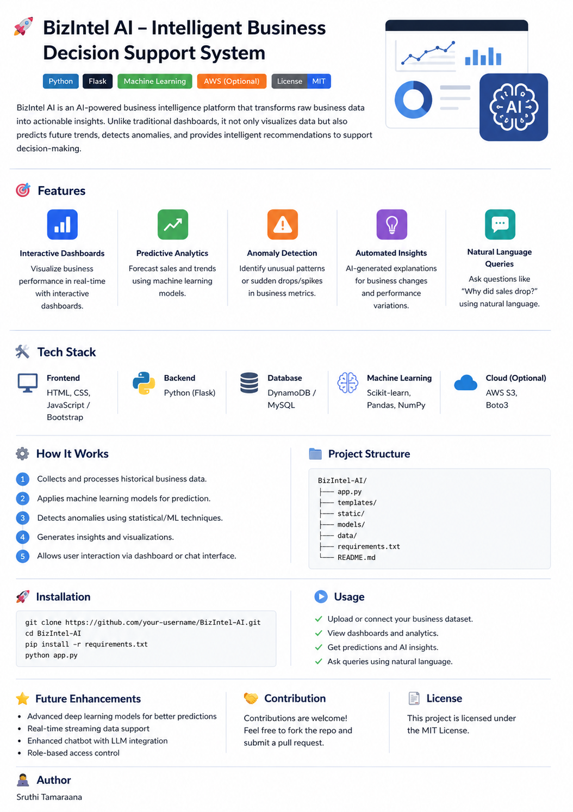
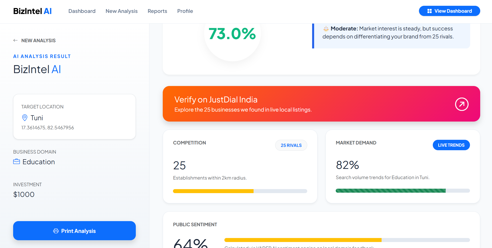

# 🚀 BizIntel AI – Intelligent Business Decision Support System

<p align="center">
  
</p>

---

## 📌 Overview
BizIntel AI is an AI-powered business intelligence platform that transforms raw business data into meaningful, actionable insights. Unlike traditional dashboards that only display historical data, this system leverages machine learning to predict future trends, detect anomalies, and provide intelligent recommendations for better decision-making.

---

## ❗ Problem Statement
Businesses often rely on static dashboards that require manual analysis and fail to provide insights into future trends or reasons behind performance changes. This leads to slow and reactive decision-making.  
BizIntel AI solves this by automating analysis, predicting outcomes, and enabling users to interact with data easily.

---

## 🎯 Key Features
- 📊 **Interactive Dashboards** – Real-time visualization of business metrics  
- 🔮 **Predictive Analytics** – Forecast sales and trends using ML models  
- ⚠️ **Anomaly Detection** – Identify unusual patterns and sudden changes  
- 💡 **Automated Insights** – AI-generated explanations for business performance  
- 💬 **Natural Language Queries** – Ask questions like *“Why did sales drop?”*  

---

## 🛠️ Tech Stack
- **Frontend:** HTML, CSS, JavaScript, Bootstrap  
- **Backend:** Python (Flask)  
- **Database:** DynamoDB / MySQL  
- **Machine Learning:** Scikit-learn, Pandas, NumPy  
- **Cloud (Optional):** AWS S3, Boto3  

---

## 🧠 How It Works
1. Collects and processes historical business data  
2. Applies machine learning models for prediction  
3. Detects anomalies using statistical/ML techniques  
4. Generates insights and visualizations  
5. Allows user interaction via dashboard or chat interface  

---

## 📸 Screenshots
<p align="center">
  
</p>

---

## 📂 Project Structure
```bash
BizIntel-AI/
│── app.py
│── templates/
│── static/
│── models/
│── data/
│── requirements.txt
│── README.md
⚙️ Installation
git clone https://github.com/your-username/BizIntel-AI.git
cd BizIntel-AI
pip install -r requirements.txt
python app.py
▶️ Usage
Upload or connect your dataset
View dashboards and analytics
Get predictions and insights
Interact using natural language
🚀 Future Enhancements
Advanced deep learning models
Real-time data streaming
AI chatbot with LLM integration
Role-based access control
🤝 Contribution

Contributions are welcome! Feel free to fork the repo and submit a pull request.

📜 License

This project is licensed under the MIT License.

👩‍💻 Author

Sruthi Tamaraana
